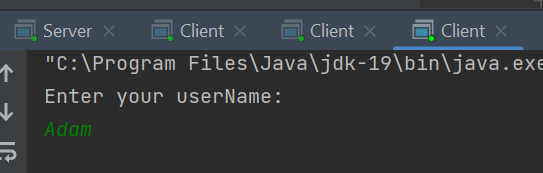
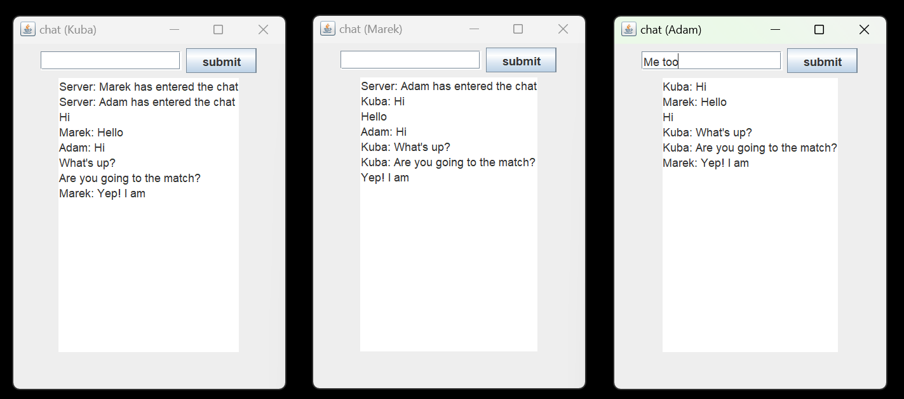

# GroupChat
## Description
GroupChat is program that esures communication between users and uses multi-threading. We have to enter our user name and then we can start a conversation.
Any number of users can join the chat.

## Example
**1. Enter your user name**
 

     
**2. Start a conversation**    
     

